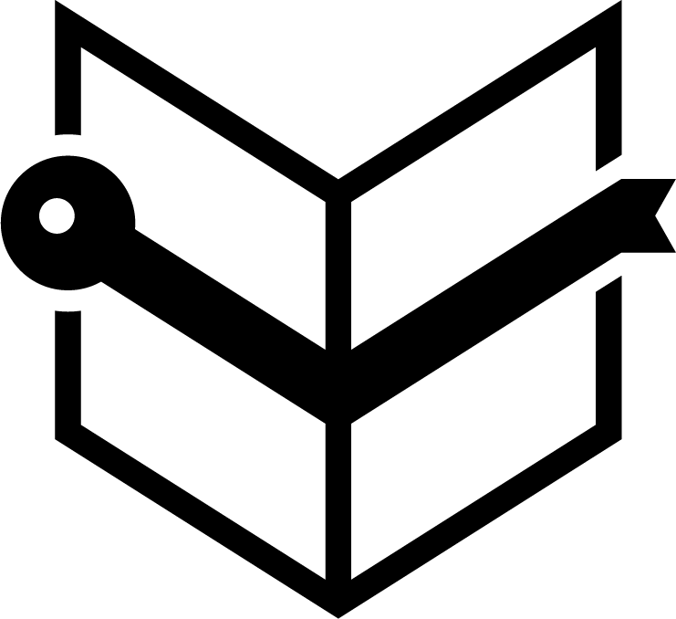

<p align="left"></p>

# Django-Bookworm
A fun project to store my learning from each book that I read.

# Features
- Easy to use GUI
- Chapter-wise bifurcation
- Generate summary from whatever your learning from each chapter are
- Get basic statistics about the books you read
- Get inspirational quotes on your homepage

# Installation

- Download or clone this repository
- Change directory to the recently cloned repository folder or unziped folder
- Run the following command to install dependencies:
    ```bash
    $pip install -r requirements.txt
    ```
- For summarization Python `nltk` is used. To download required files, execute:
    ```bash
    python prerequisites.py
    ```
- Then create a file named `.env` inside `django_bookworm/` and add following details with your details
    ```
    SECRET_KEY=<your_secret_key>
    ```
- Now, you can start the django server by executing following commands:
    ```bash
    python manage.py migrate
    python manage.py runserver
    ```

# Working


